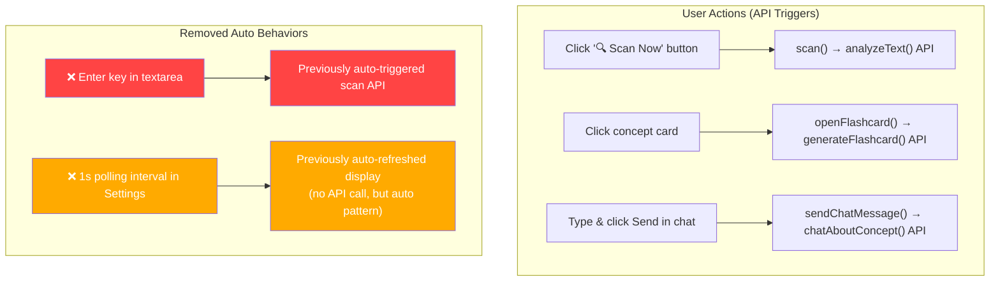

# Remove Auto-Scanning & Auto API Calls — Audit & Plan

## Audit: All API Call Paths

The app has exactly **3 API functions** in [`src/services/ai.js`](src/services/ai.js).

### 1. `analyzeText()` — Initial concept scan
**Call chain:**
- [`src/services/ai.js:119`](src/services/ai.js:119) `analyzeText()` ←
- [`src/composables/useAI.js:21`](src/composables/useAI.js:21) `ai.analyze()` ←
- [`src/App.vue:150`](src/App.vue:150) `handleScan()` ←
- [`src/components/ContentPanel.vue:9`](src/components/ContentPanel.vue:9) `@click="$emit('scan')"` — **"🔍 Scan Now" button click** ✅ user-initiated
- [`src/components/ContentPanel.vue:55`](src/components/ContentPanel.vue:55) `@keydown="onKeydown"` → **Enter key press** ⚠️ user-initiated, but intercepts normal textarea newline behavior

### 2. `generateFlashcard()` — Flashcard on card click
**Call chain:**
- [`src/services/ai.js:188`](src/services/ai.js:188) `generateFlashcard()` ←
- [`src/composables/useAI.js:70`](src/composables/useAI.js:70) `openFlashcard()` ←
- [`src/App.vue:155`](src/App.vue:155) `onSelectCard()` ←
- [`src/components/ConceptCard.vue:3`](src/components/ConceptCard.vue:3) `@click="$emit('select', card)"` — **User clicks a concept card** ✅ user-initiated

### 3. `chatAboutConcept()` — Chat message
**Call chain:**
- [`src/services/ai.js:248`](src/services/ai.js:248) `chatAboutConcept()` ←
- [`src/composables/useAI.js:46`](src/composables/useAI.js:46) `sendChatMessage()` ←
- [`src/App.vue:161`](src/App.vue:161) `onChatMessage()` ←
- [`src/components/ChatDrawer.vue:40`](src/components/ChatDrawer.vue:40) `@click="handleSend"` — **User clicks "Send" button** ✅ user-initiated

## Findings: Potential Auto Behaviors

### 🔴 Issue 1: Enter key auto-triggers scan API call
**File:** [`src/components/ContentPanel.vue:51-57`](src/components/ContentPanel.vue:51-57)

```js
function onKeydown(e) {
  if (e.key === 'Enter' && !e.shiftKey) {
    e.preventDefault()  // Blocks normal newline
    emit('scan')         // Triggers API call
  }
}
```

Pressing **Enter** (without Shift) while typing in the textarea immediately calls the API. While this is technically "user input," it:
- Intercepts the default textarea behavior (inserting a newline)
- Can be easily triggered accidentally while typing
- Is implicit — the user may not realize a simple Enter will fire an API call

**Fix:** Remove the `onKeydown` handler entirely. Let Enter behave normally (insert newline). The user must explicitly click **"🔍 Scan Now"** to trigger an API call.

### 🟡 Issue 2: Settings panel polls usage data every 1s
**File:** [`src/components/SettingsPanel.vue:112-115`](src/components/SettingsPanel.vue:112-115)

```js
interval = setInterval(refresh, 1000)
```

This auto-refreshes the usage/call log display every second. **This does NOT make any API calls** — it only reads from in-memory JS variables (`getUsage()`, `getCallLog()`). However, it's an auto-polling pattern that could be removed for cleanliness.

**Fix:** Remove the interval and only refresh on mount and on demand.

### ✅ No Issues Found In:
- [`src/composables/useScanner.js`](src/composables/useScanner.js) — All scanning is manual via `scan()` function; no timers, watchers, or auto-triggers.
- [`src/composables/useAI.js`](src/composables/useAI.js) — All functions (`analyze`, `sendChatMessage`, `openFlashcard`) are called explicitly from user events only.
- [`src/services/ai.js`](src/services/ai.js) — API functions all require `requireUnlocked()` passcode check, and are only invoked by user actions.
- [`src/App.vue`](src/App.vue) — All event handlers are wired to user-triggered events exclusively.

## Plan: Changes Required

### Step 1 — Remove Enter key shortcut in ContentPanel.vue
- Remove the `onKeydown` function and `@keydown` binding.
- Let Enter behave as normal (newline insertion).
- Update placeholder text to remove "Press Enter to scan" reference.
- This ensures the **only** way to trigger a scan is clicking "🔍 Scan Now".

### Step 2 — Remove auto-polling interval in SettingsPanel.vue
- Remove `setInterval` / `clearInterval` logic.
- Call `refresh()` only in `onMounted` (once when panel opens).
- The call log updates only when the settings panel is opened.

### Step 3 — Verify all remaining triggers
- Confirm scan button click is the sole scan trigger.
- Confirm card click is the sole flashcard trigger.
- Confirm Send button is the sole chat trigger.

## Flow Diagram


