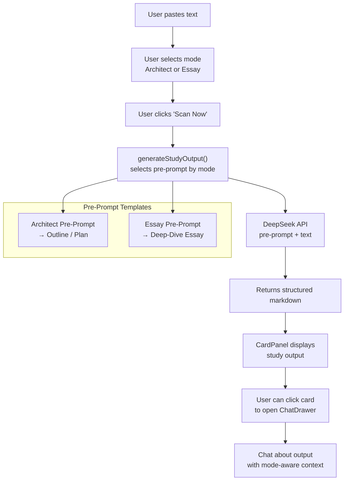

# Study Pre-Prompt System — Plan

## Overview

Replace the existing concept card extraction system with a **mode-based study output system**, modeled after the Zoo agent's mode architecture. Instead of extracting 5 concept cards from text, the AI now formats study information according to a selected **output mode**, each with its own **pre-prompt template** (system prompt).

Two initial modes:
- **Architect** — Produces a structured study outline / plan
- **Essay** — Produces a deep-dive explanatory essay

---

## Current Architecture (for reference)

```
User pastes text → Clicks "Scan Now" → analyzeText() → JSON array of 5 concepts → CardPanel displays cards → Click card → ChatDrawer shows flashcard
```

The [`analyzeText()`](src/services/ai.js:119) function uses a hardcoded system prompt that always extracts 5 concept cards. The [`generateFlashcard()`](src/services/ai.js:188) function always generates a flashcard with the same sections.

## Target Architecture

```
User pastes text → Selects mode (Architect | Essay) → Clicks "Scan Now" → 
  new generateStudyOutput(text, mode) → returns structured markdown → CardPanel or ChatDrawer displays output
```

---

## Pre-Prompt Templates

### 1. Architect Mode — Study Outline Pre-Prompt

**Purpose:** Produce a structured, hierarchical study plan/outline from the text. Similar to how the Zoo architect mode produces structured plans with clear sections.

**System Prompt:**
```
You are a study architect. Given a body of text, produce a structured study outline that 
breaks down the material into clear, logical sections. 

Format your response as follows:

# [Main Topic Title]

## 📋 Overview
A 2-3 sentence high-level summary of what this material covers.

## 🏗️ Core Concepts
- **Concept 1**: Brief definition and why it matters
- **Concept 2**: Brief definition and why it matters
- (3-5 key concepts)

## 📊 Structure Map
A hierarchical breakdown of the material:
1. **Major Section 1**
   - Subtopic A
   - Subtopic B
2. **Major Section 2**
   - Subtopic A
   - Subtopic B

## 🔗 Connections
How the key ideas relate to each other, any dependencies, or broader context.

## 📝 Study Questions
3-5 questions that test understanding of the material, ordered from foundational to advanced.

## 🎯 Key Takeaways
3 bullet points summarizing the most important things to remember.

Use clear markdown headings and formatting. Be concise but comprehensive.
```

**Input format:**
```
MODE: architect

CONTEXT:
[text content, up to 6000 chars]
```

### 2. Essay Mode — Deep-Dive Pre-Prompt

**Purpose:** Produce a flowing, essay-style explanation of the material. Similar to how the Zoo would write an in-depth analysis.

**System Prompt:**
```
You are a study essayist. Given a body of text, write an engaging, well-structured 
essay that explains the material in depth.

Format your response as follows:

# [Compelling Essay Title]

## 🧠 Introduction
Hook the reader with context and state what this essay will cover.

## 📖 Body
Organize into 3-5 sections, each with a clear heading. For each section:
- Explain the concept clearly
- Provide examples or applications where relevant
- Connect ideas back to the main theme

## 💡 Insights
What makes this material interesting or important? Any surprising implications, 
counterintuitive points, or elegant ideas worth highlighting.

## 🔄 Synthesis
Bring everything together. How do the pieces form a coherent whole? 
What's the bigger picture?

## 📚 Further Exploration
2-3 suggested directions for deeper study based on this material.

Write in an engaging, conversational yet precise tone. Use examples liberally. 
Avoid bullet-sprawl — prefer full paragraphs that flow naturally.
```

**Input format:**
```
MODE: essay

CONTEXT:
[text content, up to 6000 chars]
```

---

## Changes Required

### 1. AI Service — [`src/services/ai.js`](src/services/ai.js)

**Add new function:** `generateStudyOutput(text, mode, model, apiKey)`

- Takes a `mode` parameter: `'architect'` or `'essay'`
- Selects the appropriate pre-prompt template
- Sends to DeepSeek API with the pre-prompt as system message + text as user message
- Returns the raw markdown output (not JSON)
- Include token tracking & usage logging (same pattern as existing functions)
- Token budget: output up to 2000 tokens, temperature 0.4

**Modify `analyzeText()` (optional):** Keep it as a fallback or remove entirely if concept cards are fully deprecated.

### 2. Composable — [`src/composables/useAI.js`](src/composables/useAI.js)

**Add new state:**
- `studyMode` (ref) — `'architect'` | `'essay'`, default `'architect'`
- `studyOutput` (ref) — the raw markdown output from the AI
- `isStudyLoading` (ref) — loading state

**Add new methods:**
- `setStudyMode(mode)` — sets the active mode
- `generateStudy(text, model)` — calls `generateStudyOutput(text, mode, model)`

### 3. CardPanel — [`src/components/CardPanel.vue`](src/components/CardPanel.vue)

**Add mode selector** in the panel header, next to the title:
- Two toggle buttons: `🏗️ Architect` and `📝 Essay`
- Active mode is highlighted
- Emits `update:mode` event to parent

**Modify display:** When study output is available, show the rendered markdown instead of (or in addition to) concept cards. This could be:
- A tab-like switch between "Concepts" and "Study Output"
- Or the study output replaces the card list entirely when a mode is active

### 4. App.vue — [`src/App.vue`](src/App.vue)

**Add new state:**
- `studyMode` — passed to CardPanel
- `studyOutput` — passed to CardPanel

**Modify `handleScan()`:** 
- Instead of calling `ai.analyze()`, call `ai.generateStudy(text, settings.model)`
- Pass the current `studyMode`

**Pass mode events:**
- Wire `@update:mode` from CardPanel to update `studyMode`

### 5. ChatDrawer — [`src/components/ChatDrawer.vue`](src/components/ChatDrawer.vue)

**No changes needed initially** — the ChatDrawer remains for follow-up Q&A about the study output. The "Add to content" button still works.

However, the chat context should now include the study output text rather than concept context.

---

## Data Flow Diagram



---

## Implementation Steps

### Step 1 — Add `generateStudyOutput()` to AI service
- [ ] Add the new function in [`src/services/ai.js`](src/services/ai.js) with both pre-prompt templates
- [ ] Include token tracking and usage logging
- [ ] Test basic API call

### Step 2 — Add mode state to useAI composable
- [ ] Add `studyMode`, `studyOutput`, `isStudyLoading` refs
- [ ] Add `setStudyMode()` and `generateStudy()` methods
- [ ] Replace/update `analyze()` to use mode routing

### Step 3 — Add mode selector to CardPanel
- [ ] Add mode toggle UI in panel header
- [ ] Show study output when available
- [ ] Emit mode change events

### Step 4 — Wire up in App.vue
- [ ] Add `studyMode` state
- [ ] Update `handleScan()` to use mode-aware generation
- [ ] Wire mode events between components

### Step 5 — Update ChatDrawer context
- [ ] When chatting about study output, use study output as context instead of concept context

---

## Open Questions / Future Considerations

1. **Should concept cards coexist?** The user said "instead of concept cards" — so the old flow is replaced, not supplemented. But the CardPanel component keeps its structure.
2. **Future modes** could include: `summary`, `quiz`, `compare-contrast`, `timeline`, `explain-like-im-5`
3. **Mode persistence** — should the selected mode be saved in settings (localStorage)?
4. **Mobile layout** — the mode selector needs to work on small screens alongside the existing mobile toggle
