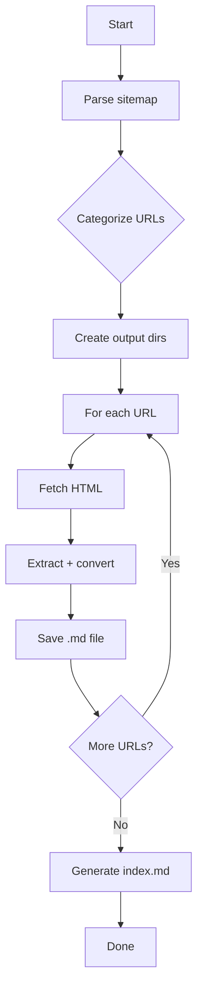

# Temple of Zeus Website Scraper — Plan

## Overview

Download all text content from `templeofzeus.org` using the provided XML sitemap ([`6611407_525.xml`](../6611407_525.xml)), organized into category folders as Markdown (`.md`) files.

**Source**: `https://templeofzeus.org/` — a Zevist religious/philosophical website  
**Sitemap**: ~300+ URLs across 18 logical categories  
**Output Format**: Markdown (`.md`)  
**Language**: Node.js (JavaScript, ESM modules)  
**Excluded**: `search_ai.php`, `search.php` (search tools, no substantive content)

---

## Output Directory Structure

```
temple-of-zeus-content/
├── 01-Main/              # Root-level index and gateway pages
├── 02-About/             # About the religion, beliefs, core concepts
├── 03-Gods/              # Individual deity pages (Zeus, Odin, Thor, etc.)
├── 04-Doctrines/         # Sacred texts, declarations, scripture compilations
├── 05-Philosophy/        # Advanced philosophical writings
├── 06-Zevism-Branches/   # Zevism tradition branches (Hellenic, Egyptian, Vedic, etc.)
├── 07-Afterlife/         # Afterlife doctrines and eschatology
├── 08-Magick/            # Magickal practices, spells, and techniques
├── 09-Squares/           # Planetary magick squares
├── 10-Chakras-Meditations/  # Chakra work, meditation techniques
├── 11-Enlightenment/     # Spiritual warfare and enlightenment resources
├── 12-Personalities/     # Historical figures and philosophers
├── 13-Family/            # Community teachings (I–XIV series)
├── 14-Coven/             # Coven guidelines and operations
├── 15-Rites/             # Rites, rituals, ceremonies, holidays
├── 16-Ethics/            # Ethical teachings
├── 17-Virtues/           # Virtue teachings per deity
├── 18-Liturgical-Terms/  # Liturgical terminology glossary
├── 19-Resources/         # Rights documents, FAQ, references
└── index.md              # Summary index of all downloaded pages
```

### Category Mapping Rules

| Category | Match Pattern | Example URLs |
|----------|--------------|--------------|
| `01-Main` | Root `.php` files that are gateway/intro pages | `HOME.php`, `ForNewbies.php`, `Updates.php`, `Welcome.php`, `NEWPEOPLE.php`, `FAQ.php`, `HELP.php` |
| `02-About` | Root `.php` files about belief system | `Our_God.php`, `TRADITIONAL.php`, `Our_Origins.php`, `EthicsOftheGods.php`, `TheGods.php`, `Symbols.php`, `Pantheon.php`, `How_Zeus_Became_the_Devil.php`, etc. |
| `03-Gods` | Individual deity filename (sky god names) | `Zeus.php`, `OdinName.php`, `Thor.php`, `Indra.php`, `Amun.php`, `Marduk.php`, `SATANAS.php`, etc. |
| `04-Doctrines` | `/doctrines/*` path prefix | All URLs under `/doctrines/` |
| `05-Philosophy` | `/advancedphilosophy/*` path prefix | All URLs under `/advancedphilosophy/` |
| `06-Zevism-Branches` | Filename starts with `Zevism_` | `Zevism_Hellenic.php`, `Zevism_Egyptian.php`, etc. |
| `07-Afterlife` | Afterlife-related filenames | `Zevist_Afterlife_Doctrine.php`, `Myth_of_Er.php`, `Tartarus.php`, `Afterlife.php`, etc. |
| `08-Magick` | Magick practice filenames | `Banishing.php`, `Evocation.php`, `Healing.php`, `Protection.php`, `Sex_Magick.php`, etc. |
| `09-Squares` | Filename ends with `_Square.php` or `_Squares.php` | `Zeus_Squares.php`, `Jupiter_Square.php`, etc. |
| `10-Chakras-Meditations` | Chakra/meditation filenames | `The_Chakras.php`, `Meditation.php`, `Kundalini.php`, `Pineal_Meditation.php`, etc. |
| `11-Enlightenment` | `/enlightenment/*` path prefix | All URLs under `/enlightenment/` |
| `12-Personalities` | `/personalities/*` path prefix | All URLs under `/personalities/` |
| `13-Family` | `/family/*` path prefix | All URLs under `/family/` |
| `14-Coven` | `/coven/*` path prefix | All URLs under `/coven/` |
| `15-Rites` | Rites/ritual filenames | `Baptism.php`, `Funeral.php`, `Prayer.php`, `HOLIDAYS.php`, etc. |
| `16-Ethics` | Filename starts with `life_ethics_` or `Ethics_` | `life_ethics_politeness.php`, `Ethics_Core.php`, etc. |
| `17-Virtues` | Filename matches `*_virtue_*.php` or `Virtue_*.php` | `Zeus_virtue_2.php`, `Virtue_Truth.php`, etc. |
| `18-Liturgical-Terms` | Filename starts with `liturgical_terms_` | `liturgical_terms_maat.php`, etc. |
| `19-Resources` | Miscellaneous reference pages | `Rights_EU.php`, `Rights_International.php` |

---

## Architecture

```
scraper/
├── package.json            # Dependencies: cheerio, turndown
├── index.js                # Main entry point — orchestrates the full pipeline
├── lib/
│   ├── parse-sitemap.js    # Parses XML sitemap, extracts URLs, filters exclusions
│   ├── categorize.js       # Maps each URL to a category folder using rules above
│   ├── fetch-page.js       # Fetches HTML with rate limiting (300ms delay), retries, error handling
│   ├── extract-content.js  # Extracts main text from HTML, converts to Markdown via turndown
│   └── save-file.js        # Writes Markdown files to the correct category subfolder
└── output/
    └── temple-of-zeus-content/   # Generated output directory
```

### Data Flow


---

## Module Specifications

### 1. `parse-sitemap.js`

- Read and parse `6611407_525.xml`
- Extract all `<loc>` values
- Filter out `search_ai.php` and `search.php`
- Return array of `{ url, path }` objects (where `path` is the relative path from domain root)
- Use Node.js built-in `fs` and `path` modules + regex/string parsing (no XML parser needed — can use simple regex since structure is consistent)

### 2. `categorize.js`

- Accept URL path string
- Apply mapping rules in order (path prefix checks first, then filename pattern matching)
- Return category folder name string (e.g., `"03-Gods"`)
- Include a fallback category `"99-Uncategorized"` for any unmatched URLs

### 3. `fetch-page.js`

- Use Node.js built-in `fetch` (available in Node 18+)
- Implement:
  - 300ms delay between requests (respect the server)
  - Retry logic: 3 retries with exponential backoff (1s, 3s, 9s)
  - Timeout: 15 seconds per request
  - User-Agent header: `Mozilla/5.0 TempleOfZeus-Archiver/1.0`
  - Error logging for failed URLs (continue on error, don't abort)
- Return raw HTML string

### 4. `extract-content.js`

- Use `cheerio` to parse HTML
- Extract:
  - `<title>` → becomes the Markdown H1 heading
  - Main content area — heuristic: select the largest `<div>` or `<article>` block, or `<body>` content
  - Remove: `<script>`, `<style>`, `<nav>`, `<header>`, `<footer>`, `<aside>` elements
- Use `turndown` to convert cleaned HTML to Markdown
- Sanitize: remove excessive blank lines, normalize whitespace
- Add YAML frontmatter with:
  ```yaml
  ---
  title: <page title>
  source: <full URL>
  category: <category name>
  retrieved: <ISO date>
  ---
  ```
- Return Markdown string

### 5. `save-file.js`

- Create output directory structure:
  - `temple-of-zeus-content/<category>/<filename>.md`
- Filename derived from the URL path (e.g., `Zeus.php` → `Zeus.md`)
- For index pages, use `index.md`
- Write file with UTF-8 encoding

### 6. `index.js` (Main Orchestrator)



- Command-line progress bar using a simple logger (dots or counts)
- Summary report at end: total pages, succeeded, failed, skipped

---

## Dependencies

Add to a new `scraper/package.json`:

```json
{
  "name": "temple-of-zeus-scraper",
  "type": "module",
  "dependencies": {
    "cheerio": "^1.0.0",
    "turndown": "^7.2.0"
  }
}
```

---

## Implementation Steps

### Step 1 — Initialize project
- Create `scraper/` directory
- Create `scraper/package.json` with dependencies
- Run `npm install` in the `scraper/` directory

### Step 2 — Create `lib/parse-sitemap.js`
- Read `../6611407_525.xml` (relative to scraper dir, one level up)
- Extract all URLs with regex
- Filter exclusions
- Return structured array

### Step 3 — Create `lib/categorize.js`
- Implement all category mapping rules
- Test with a handful of known URLs

### Step 4 — Create `lib/fetch-page.js`
- Implement fetch with rate limiting and retries
- Add timeout handling
- Return HTML string or null on failure

### Step 5 — Create `lib/extract-content.js`
- Parse HTML with cheerio
- Clean and extract main content
- Convert to Markdown with turndown
- Add YAML frontmatter

### Step 6 — Create `lib/save-file.js`
- Ensure category directories exist
- Write Markdown files

### Step 7 — Create `index.js`
- Wire all modules together
- Add progress reporting
- Generate summary index page

### Step 8 — Run and verify
- Execute the scraper
- Check a sample of output files across categories
- Fix any issues (missing content, wrong categorization, encoding problems)

---

## Edge Cases & Considerations

1. **Rate Limiting**: 300ms between requests = ~3.3 pages/second. For ~300 pages, total ~90 seconds. Conservative but respectful.
2. **Encoding**: The sitemap specifies UTF-8. Use `utf-8` consistently.
3. **Redirects**: `fetch` follows redirects by default — handle gracefully.
4. **404s/Errors**: Log and skip, don't abort the batch.
5. **Empty Content**: Some pages may have JS-rendered content not in static HTML. Note in the output that content may be incomplete.
6. **Special Characters**: Filenames may have characters invalid on Windows (e.g., `:`, `?`, `*`). Sanitize filenames.
7. **The sitemap index** (`/`) and `HOME.php` both point to essentially the same content — that's fine, keep both.
